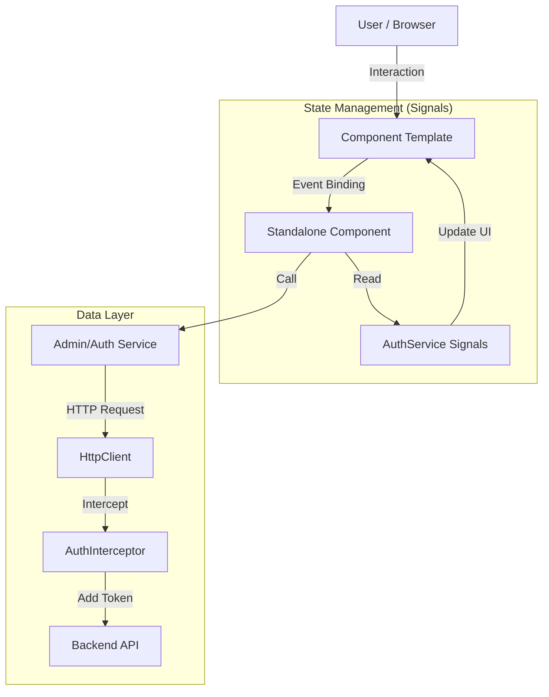

# CrowGallery - Web Frontend

**CrowGallery Frontend** is a modern, responsive single-page application (SPA) built to manage and view photo collections. It serves as the user interface for the high-performance C++ [CrowQtServer] backend.

Built with the latest **Angular v21**, it leverages **Standalone Components**, **Signals** for reactive state management, and **Angular Material** for a polished UI.

---

## 🚀 Features

### 🔐 Authentication & Security

- **JWT Authentication:** Secure login with Access and Refresh Token handling.
- **Role-Based Access Control:** Distinct views and capabilities for `User` and `Admin`.
- **Security Guards:** Route protection via `AuthGuard` and `PasswordResetGuard`.
- **Forced Password Rotation:** Enforces password changes for new users or expired credentials.
- **HTTP Interceptor:** Automatically attaches Bearer tokens to outgoing requests.

### 📸 Gallery & Dashboard

- **Responsive Dashboard:** Adaptive grid layout for various screen sizes.
- **Private & Public Views:** Users can manage their own uploads (planned).
- **Modern UI:** Clean aesthetic using Material Design 3.

### 🛠️ Administration

- **User Management:** Admins can Create, Delete, and Deactivate users.
- **Status Monitoring:** Visual indicators for user status (Active/Locked).
- **Password Resets:** Admin-triggered password resets via a dedicated Dialog UI.

---

## 🏗️ Architecture

This project follows a **Feature-Based Architecture** using **Angular Standalone Components**. It moves away from `NgModules` to reduce boilerplate and improve tree-shaking.

### High-Level Overview

