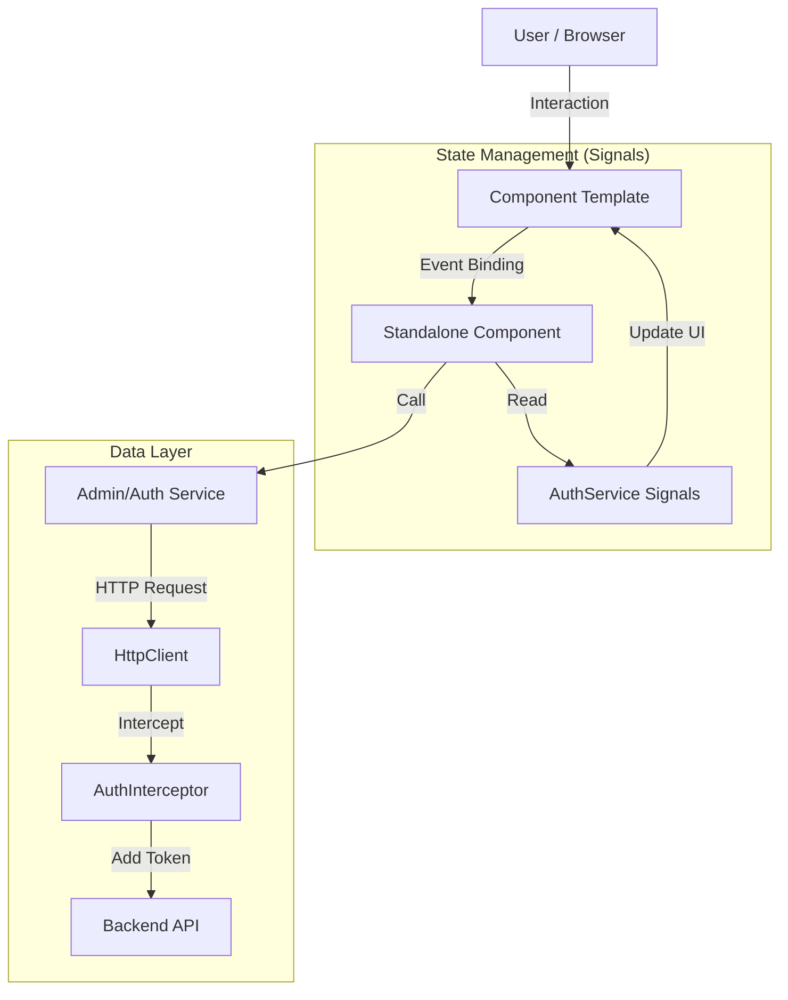

<div id="top" align="center">
<h1>CrowQtServer - Admin Web Frontend</h1>

<p>extending web-gallery_webserver to SCS (user management etc)</p>

<p>Part of the Crow-Gallery Project</p>

[](https://choosealicense.com/licenses/mit/)
[](https://github.com/Zheng-Bote/web-gallery_webserver-admin/releases)

[Report Issue](https://github.com/Zheng-Bote/web-gallery_webserver-admin/issues) · [Request Feature](https://github.com/Zheng-Bote/web-gallery_webserver-admin/pulls)

</div>

<hr>

<!-- START doctoc generated TOC please keep comment here to allow auto update -->
<!-- DON'T EDIT THIS SECTION, INSTEAD RE-RUN doctoc TO UPDATE -->

**Table of Contents**

- [Description](#description)
  - [🚀 Features](#-features)
    - [🔐 Authentication \& Security](#-authentication--security)
    - [📸 Gallery \& Dashboard](#-gallery--dashboard)
    - [🛠️ Administration](#️-administration)
- [⚙️ Installation \& Setup](#️-installation--setup)
  - [Prerequisites](#prerequisites)
  - [Installation](#installation)
  - [📂 Project Structure](#-project-structure)
- [🏗️ Architecture](#️-architecture)
  - [High-Level Overview](#high-level-overview)
  - [Key Architectural Concept](#key-architectural-concept)
  - [🛠️ Tech Stack](#️-tech-stack)
- [Framework: Angular v21](#framework-angular-v21)
- [📄 License](#-license)
- [Authors](#authors)
  - [Code Contributors](#code-contributors)

<!-- END doctoc generated TOC please keep comment here to allow auto update -->
<hr>

# Description


**CrowGallery Frontend** is a modern, responsive single-page application (SPA) built to manage and view photo collections. It serves as the user interface for the high-performance C++ [CrowQtServer] backend.

Built with the latest **Angular v21**, it leverages **Standalone Components**, **Signals** for reactive state management, and **Angular Material** for a polished UI.

---

## 🚀 Features

### 🔐 Authentication & Security

- **JWT Authentication:** Secure login with Access and Refresh Token handling.
- **Role-Based Access Control:** Distinct views and capabilities for `User` and `Admin`.
- **Security Guards:** Route protection via `AuthGuard` and `PasswordResetGuard`.
- **Forced Password Rotation:** Enforces password changes for new users or expired credentials.
- **HTTP Interceptor:** Automatically attaches Bearer tokens to outgoing requests.

### 📸 Gallery & Dashboard

- **Responsive Dashboard:** Adaptive grid layout for various screen sizes.
- **Private & Public Views:** Users can manage their own uploads (planned).
- **Modern UI:** Clean aesthetic using Material Design 3.

### 🛠️ Administration

- **User Management:** Admins can Create, Delete, and Deactivate users.
- **Status Monitoring:** Visual indicators for user status (Active/Locked).
- **Password Resets:** Admin-triggered password resets via a dedicated Dialog UI.

---

# ⚙️ Installation & Setup

## Prerequisites

- Node.js (v18 or higher)
- npm

## Installation

Running instance of the CrowQtServer backend.

1. Clone the repository

```bash
git clone https://github.com/yourusername/web-gallery-frontend.git
cd web-gallery-frontend
```

2. Install Dependencies

```bash
npm install
```

3. Configure Environment

Check `src/environments/environment.ts`. Ensure `apiUrl` points to your C++ backend.

```TypeScript
export const environment = {
production: false,
apiUrl: 'http://localhost:8080' // Adjust port if necessary
};
```

4. Run Development Server

```Bash
ng serve
```

Navigate to `http://localhost:4200/`.

## 📂 Project Structure

````
src
├── app/
│   ├── components/      # Shared UI (Navbar, etc.)
│   ├── dialogs/         # Modal Dialogs (Password Reset)
│   ├── guards/          # Route protection logic
│   ├── interceptors/    # HTTP Request modification
│   ├── models/          # TypeScript Interfaces
│   ├── pages/           # Views (Dashboard, Login, Admin)
│   ├── service/         # API communication & State
│   ├── app.component.ts # Root layout
│   ├── app.config.ts    # Global provider config
│   └── app.routes.ts    # Routing definitions
└── environments/        # API configuration```
````

# 🏗️ Architecture

This project follows a **Feature-Based Architecture** using **Angular Standalone Components**. It moves away from `NgModules` to reduce boilerplate and improve tree-shaking.

### High-Level Overview



## Key Architectural Concept

**signal-Driven State**:

We utilize Angular Signals (e.g., currentUser, passwordChangeRequired) instead of complex RxJS streams for synchronous state management.

This ensures "Zoneless" compatibility and fine-grained UI updates.

**Standalone Components**:

Components (e.g., UserManagementComponent, NavbarComponent) directly import their dependencies.

This makes the codebase easier to refactor and test.

**Security Layer**:

- Interceptor: The authInterceptor centrally manages the Authorization header.
- Guards: Functional guards (CanActivateFn) handle redirect logic (e.g., forcing a user to change their password before accessing the dashboard).

## 🛠️ Tech Stack

# Framework: Angular v21

- Language: TypeScript 5.x
- UI Library: Angular Material v21 & CDK
- Styling: SCSS / CSS3 (Grid & Flexbox)
- Icons: Material Icons
- Build Tool: Angular CLI

# 📄 License

Distributed under the MIT License. See LICENSE for more information.

Copyright (c) 2025 ZHENG Robert

# Authors

- [](https://www.github.com/Zheng-Bote)

### Code Contributors


[](https://www.github.com/Zheng-Bote)

<hr>

:vulcan_salute:
